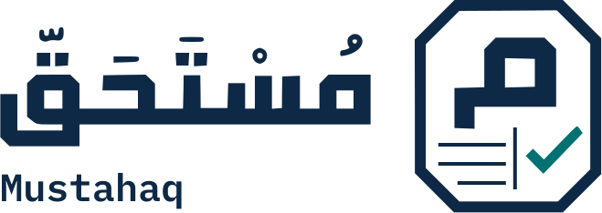
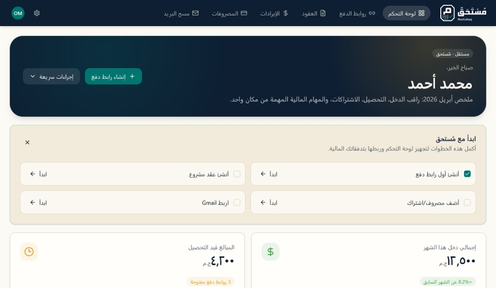
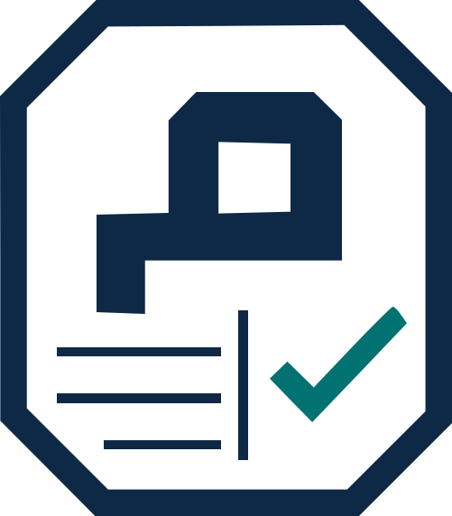

<div align="center">



<br />
<br />

**The Arabic-first financial operating system for MENA freelancers**

*Contract · Collect · Track · Protect your earned money*

<br />

[](https://php.net)
[](https://laravel.com)
[](https://react.dev)
[](https://postgresql.org)
[](https://docker.com)
[](LICENSE)

<br />



<br />
<br />

[🌐 **Live Demo**](https://mustahaq.example.com) · [📖 **Documentation**](docs/prd.md) · [🐛 **Report Bug**](https://github.com/omar-the-junior/salam-hack-2026/issues) · [🚀 **Deploy Guide**](docs/deploy-handbook.md)

</div>

---

## ✨ What It Does

مُسْتَحَقّ brings scattered freelance finances into one orderly workspace — no more WhatsApp links, Excel chaos, or forgotten subscriptions.

<table>
<tr>
<td width="50%">

### 💳 Payment Links
Shareable payment requests via **Paymob** — Cards, Fawry, Vodafone Cash, Orange Money. Get paid in seconds.

</td>
<td width="50%">

### 📜 Milestone Contracts
Professional contracts with client acceptance and staged payment releases. Document-like, not generic SaaS.

</td>
</tr>
<tr>
<td width="50%">

### 📊 Income Tracker
Unified dashboard — auto-logs from payments + manual entries. See your cash flow at a glance.

</td>
<td width="50%">

### 💸 Expense Manager
Track SaaS subscriptions with renewal alerts and AI-powered cancellation help. Stop leaking money.

</td>
</tr>
<tr>
<td colspan="2" align="center">

### 🤖 AI Email Scanner
Connect Gmail → auto-detect subscriptions from emails. Gemini + OpenRouter parse your inbox so you don't have to.

</td>
</tr>
</table>

---

## 🚀 Quick Start

### Prerequisites

- **PHP** 8.4+
- **Composer** 2.x
- **Node.js** 20+
- **pnpm** (enabled via corepack)

### Local Development

```bash
# 1. Clone
git clone https://github.com/omar-the-junior/salam-hack-2026.git
cd salam-hack-2026

# 2. Setup (installs dependencies, runs migrations, builds frontend)
composer setup

# 3. Start dev environment (server + queue worker + Vite)
composer dev
```

Visit **http://localhost:8000** — local dev uses SQLite, no PostgreSQL needed.

### Docker (Production)

```bash
# Build the production image
docker build -t mustahaq:local .

# Run with PostgreSQL env vars
docker run --rm -p 8080:80 \
  -e APP_KEY="base64:YOUR_KEY" \
  -e APP_ENV=production \
  -e DB_CONNECTION=pgsql \
  -e DB_HOST=your-postgres-host \
  -e DB_PORT=5432 \
  -e DB_DATABASE=mustahaq \
  -e DB_USERNAME=mustahaq_user \
  -e DB_PASSWORD=your-password \
  mustahaq:local
```

See the [**Deployment Handbook**](docs/deploy-handbook.md) for full VPS + Dockploy setup.

---

## 🛠 Tech Stack

| Layer | Technology |
|---|---|
| **Backend** | Laravel 13 · PHP 8.4 · PostgreSQL |
| **Frontend** | React 19 · TypeScript · Inertia.js v3 · shadcn/ui · TailwindCSS 4 |
| **AI** | Google Gemini · OpenRouter (fallback) |
| **Payments** | Paymob API (Cards, Fawry, Mobile Wallets) |
| **Email** | Gmail OAuth (scanner) · Resend (notifications) |
| **Storage** | Local (Docker volume) · MinIO / Cloudflare R2 (future) |
| **Infrastructure** | Docker · Apache · GitHub Actions CI/CD · Dockploy |

---

## 🏗 Architecture

```
┌─────────────────────────────────────────────────────────┐
│                      VPS (Dockploy)                      │
│                                                          │
│  ┌──────────────┐     ┌──────────────┐                   │
│  │   Apache     │     │  PostgreSQL  │                   │
│  │  (Laravel)   │────▶│  (External)  │                   │
│  │  Port 80     │     │  Port 5432   │                   │
│  └──────┬───────┘     └──────────────┘                   │
│         │                                                │
│  ┌──────▼───────┐                                       │
│  │  Docker      │    GitHub Actions                     │
│  │  Volume      │◀─── GHCR Image ──── Build & Push     │
│  │  (storage)   │    (auto on push)                     │
│  └──────────────┘                                       │
│                                                          │
│  Dockploy Reverse Proxy → SSL Termination                │
└─────────────────────────────────────────────────────────┘
```

---

## 📂 Documentation

| Document | Description |
|---|---|
| [PRD](docs/prd.md) | Product Requirements Document |
| [Architecture](docs/architecture.md) | System Design & Architecture |
| [Design System](docs/DESIGN.md) | Brand Identity, Colors, Typography |
| [DB Schema](docs/DB-design.md) | Database Structure |
| [Deployment](docs/DEPLOYMENT.md) | Docker & CI/CD Reference |
| [Deploy Handbook](docs/deploy-handbook.md) | VPS + Dockploy + PostgreSQL Setup |
| [Use Cases](docs/use-cases/) | UC-001 → UC-016 detailed flows |
| [Technical Specs](docs/technical-specs.md) | Technical Specifications |

---

## ⌨️ Scripts

| Command | Action |
|---|---|
| `composer setup` | Full install + migrate + frontend build |
| `composer dev` | Server + queue worker + Vite dev server |
| `composer test` | Run tests + linting |
| `pnpm run build` | Production frontend build |
| `pnpm run lint` | ESLint fix |
| `pnpm run format` | Prettier code formatting |
| `vendor/bin/pint` | PHP code formatting (Laravel Pint) |

---

## 👥 Contributors

<table>
<tr>
<td align="center">
  <br />
  <b>Omar (The Junior)</b><br />
  <sub>Full Stack Developer & Architect</sub><br />
  <a href="https://github.com/omar-the-junior">@omar-the-junior</a>
</td>
<td align="center">
  <br />
  <b>Your Name</b><br />
  <sub>Your Role</sub><br />
  <a href="https://github.com/username">@username</a>
</td>
</tr>
</table>

---

<div align="center">

**SalamHack 2026 · Track 2 · Fintech**

 مُسْتَحَقّ — *What is owed, deserved, or due*

Distributed under the MIT License. See [`LICENSE`](LICENSE) for more information.

</div>
