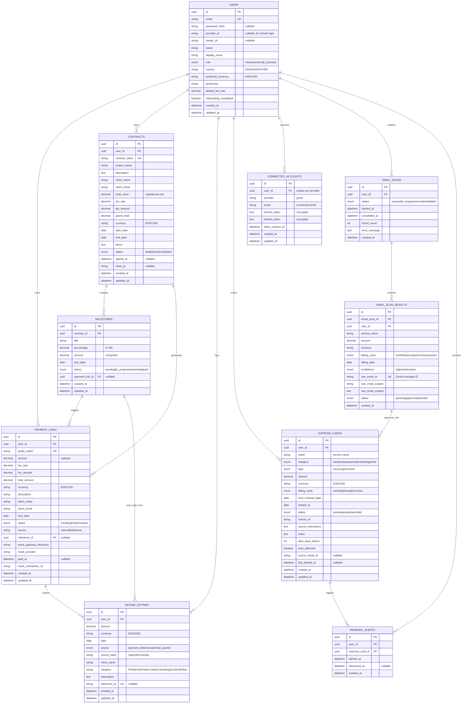

# Financial OS — Database Design

This document outlines the database schema for the Financial OS MVP, based on the Product Requirements Document (PRD) and Use Cases (UC-001 through UC-013).

## Entity Relationship Diagram

## Schema Summary

### Core Tables (Authentication & Profile)
- **`users`**: Stores credentials and profile data (name, country, currency, profession, onboarding status).

### Module 1: Payment Links & Contracts
- **`payment_links`**: Tracks standalone or milestone-based payment requests with tax breakdown, status tracking, mock gateway reference, and source attribution.
- **`contracts`**: Manages project agreements with contract lifecycle (draft → active → completed) and digital acceptance (signed_at, client_ip).
- **`milestones`**: Breaks down contracts into stages, tracking lifecycle and linking directly to payment links.

### Module 2: Income Management
- **`income_entries`**: Tracks income from multiple sources (payment links, manual entry, email-parsed) with categories and reference IDs to prevent duplicate entries.

### Module 3: Expenses & Subscriptions
- **`expense_cards`**: Manages recurring/one-time expenses, cancellation instructions, auto-detection flags, and renewal alerting configurations.
- **`renewal_alerts`**: Tracks alert history and user dismissals to prevent redundant notifications.

### Module 4: AI Subscription Scanner (Email Agent)
- **`connected_accounts`**: Stores encrypted OAuth tokens (e.g., Gmail) linking an email provider to the user.
- **`email_scans`**: Tracks background scan jobs (queued → in_progress → completed/failed).
- **`email_scan_results`**: Stores parsed subscription candidates extracted by AI, including confidence scores and reference IDs, pending user approval.

## Key Design Patterns

- **Tax Breakdown**: Stored as separate fields (`tax_rate`, `tax_amount`, `total_amount`) for both payment links and contracts to ensure clear financial reporting.
- **Source Attribution**: Utilizes `reference_id` on income entries, `source_email_id` on expense cards, and the `source` field on payment links for complete income traceability.
- **Idempotency**: Unique constraints on tokens, email IDs, and reference IDs prevent duplicate records, especially important for webhook parsing and email scanning.
- **Status Enums**: Each entity tracks its own lifecycle status (e.g., Pending → Paid, draft → active → completed, queued → completed).
- **Multi-Currency**: EGP and USD are supported throughout, mapped back to the configurable defaults per user.
- **Digital Acceptance**: Contracts record the `signed_at` timestamp and `client_ip` to provide proof of e-signature acceptance.
