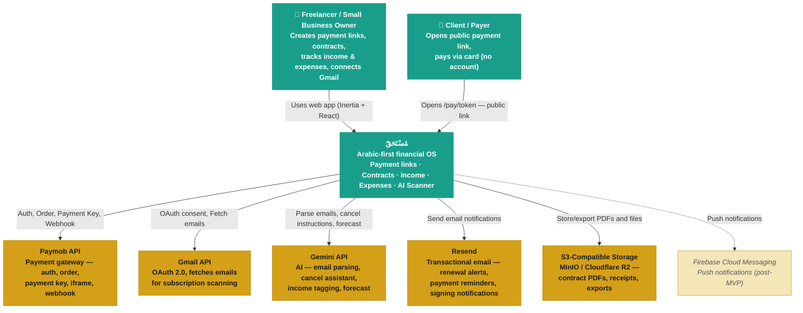

# مُسْتَحَقّ — Architecture

**Source:** Derived from `docs/prd.md`, `docs/technical-specs.md`, `docs/DB-design.md`, and use cases UC-001 through UC-014.
**Version:** 1.1

---

## Level 1 — System Context

The highest-level view. Shows مُسْتَحَقّ as a single system, the people who use it, and the external systems it depends on.



### Actor Narratives

| Actor | Description |
|-------|-------------|
| **Freelancer / SBO** | Primary user. Registers, completes onboarding, creates payment links & contracts, tracks income/expenses, connects Gmail for AI scanning. Arabic-first UX. |
| **Client / Payer** | Unauthenticated. Receives a shareable payment URL, reviews amount + description, pays via Paymob-hosted card form. No account required. |

### External System Narratives

| System | Role in مُسْتَحَقّ |
|--------|-------------------|
| **Paymob API** | Three-step checkout: authenticate → create order → get payment key → redirect to iframe. Webhook confirms payment outcome (success/failure). HMAC-signed. |
| **Gmail API** | OAuth 2.0 consent → fetch last 6 months of emails → filter by sender/subject patterns → pass to Gemini for parsing. |
| **Gemini API** | Powers AI features: email subscription parsing (structured JSON), cancel-subscription assistant (web search + instructions), income auto-tagging, cash-flow forecast. |
| **Resend** | Transactional email provider for renewal alerts, payment reminders, contract-signing confirmations. |
| **S3-Compatible Storage** | Stores generated contract PDFs, exported reports, and uploaded receipts/invoices. MinIO for local dev, Cloudflare R2 for production. |
| **Firebase Cloud Messaging** | Push notifications for renewal reminders and payment status. Post-MVP. |

---

## Level 2 — Container

Shows the high-level shape of the software architecture: how responsibilities are distributed across deployable units (containers) and how they communicate.

```mermaid
flowchart TB
    classDef person fill:#1A9E8C,stroke:#148F7E,color:#fff,font-weight:bold
    classDef container fill:#B2E0DA,stroke:#1A9E8C,color:#1a1a1a,font-weight:bold
    classDef db fill:#2D9E4F,stroke:#228B3B,color:#fff,font-weight:bold
    classDef queue fill:#4B4EC9,stroke:#3A3DB0,color:#fff,font-weight:bold
    classDef external fill:#D4A017,stroke:#B8890F,color:#1a1a1a,font-weight:bold
    classDef storage fill:#F5E6B8,stroke:#D4A017,color:#1a1a1a,font-weight:bold

    subgraph mustahaq["مُسْتَحَقّ"]
        direction TB
        web_app["Laravel Web App<br/>PHP / Laravel 11<br/>MVC + Inertia.js v3<br/>Routing · Auth · Validation · Business Logic"]
        spa["React SPA<br/>React 18 + TypeScript<br/>shadcn/ui · TailwindCSS<br/>Client-rendered pages via Inertia"]
        db[("PostgreSQL Database<br/>Production-grade · All entities<br/>Users · PaymentLinks · Contracts · Income · Expenses")
        queue["Queue Worker<br/>Laravel Queue<br/>Email scan · Renewal alerts · PDF generation"]
        files[("File Storage<br/>MinIO / Cloudflare R2<br/>Contract PDFs · Exports · Receipts")]
    end

    paymob["Paymob API<br/>Payment gateway"]
    gmail["Gmail API<br/>Email provider"]
    gemini["Gemini API<br/>AI engine"]
    resend["Resend<br/>Transactional email"]

    freelancer["👤 Freelancer / SBO"]
    client["👤 Client / Payer"]

    class freelancer person
    class client person
    class web_app container
    class spa container
    class db db
    class queue queue
    class files storage
    class paymob external
    class gmail external
    class gemini external
    class resend external

    freelancer -->|"HTTPS, Inertia visits"| web_app
    client -->|"HTTPS, /pay/token"| web_app
    web_app -->|"Inertia::render() props"| spa
    spa -->|"Inertia form submissions"| web_app
    web_app -->|"Eloquent ORM"| db
    web_app -->|"dispatch() jobs"| queue
    queue -->|"Read/write job state"| db
    queue -->|"Parse emails, cancel instructions"| gemini
    queue -->|"Fetch email messages"| gmail
    queue -->|"Send notification emails"| resend
    web_app -->|"Auth, Order, Payment Key"| paymob
    web_app -->|"Store/retrieve PDFs and exports"| files
    paymob -->|"Webhook POST /webhook/paymob"| web_app
```

### Container Narratives

| Container | Technology | Responsibility |
|-----------|-----------|----------------|
| **Laravel Web App** | PHP 8.x / Laravel 11, Inertia.js v3 adapter | All server-side logic: routing, authentication (session-based), authorization, validation, business logic, Inertia page rendering. Controllers return `Inertia::render()` instead of Blade views. JSON endpoints only for webhooks and AJAX helpers. |
| **React SPA** | React 18 + TypeScript, shadcn/ui components, TailwindCSS | Client-rendered UI. Receives page props from Inertia. No React Router — navigation is driven by Laravel routes via Inertia visits. |
| **PostgreSQL Database** | PostgreSQL 15+ (production), SQLite (local dev) | Relational DB. All entities from DB-design.md. UUIDs for primary keys on financial records. |
| **Queue Worker** | Laravel Queue (sync or database driver for MVP) | Runs background jobs: email scan pipeline (UC-009/010), renewal alert dispatch (UC-011), PDF generation (UC-012), data export (UC-013). |
| **File Storage** | MinIO (dev) / Cloudflare R2 (prod) | Contract PDFs, income/expense export files, receipt uploads. Accessed via Laravel `Storage` facade. |

### Key Data Flows

| Flow | Path |
|------|------|
| **Create payment link** | Freelancer → Laravel (Inertia POST) → PostgreSQL → Inertia redirect to show page |
| **Client pays** | Client → Laravel (GET /pay/{token}) → Paymob (3-step API) → Client redirects to Paymob iframe → Paymob webhook → Laravel updates PostgreSQL |
| **Email scan** | Freelancer → Laravel (OAuth redirect) → Gmail consent → Laravel dispatches queue job → Queue fetches Gmail → Queue sends to Gemini → Queue writes results to PostgreSQL → Freelancer reviews & confirms |
| **Cancel subscription** | Freelancer → Laravel (POST) → Gemini API (web search) → Laravel saves result to expense card |
| **Contract PDF** | Freelancer → Laravel → DomPDF generates PDF → stored in File Storage → download link returned |

---

## Level 3 — Component

Decomposes the **Laravel Web App** container into its internal components (modules), showing how responsibilities are organized within the monolith.

```mermaid
flowchart TB
    classDef module fill:#B2E0DA,stroke:#1A9E8C,color:#1a1a1a,font-weight:bold
    classDef middleware fill:#F5E6B8,stroke:#D4A017,color:#1a1a1a,font-weight:bold
    classDef db fill:#2D9E4F,stroke:#228B3B,color:#fff,font-weight:bold
    classDef service fill:#D4A017,stroke:#B8890F,color:#1a1a1a,font-weight:bold
    classDef notification fill:#4B4EC9,stroke:#3A3DB0,color:#fff,font-weight:bold

    subgraph app["Laravel Web App"]
        direction TB
        auth_module["Auth Module<br/>UC-001 · Register, login, profile CRUD<br/>UC-001b · Onboarding wizard<br/>default_tax_rate"]
        payment_module["Payment Links Module<br/>UC-002 · Create/list/show links<br/>UC-014 · Paymob integration<br/>Tax computation"]
        contract_module["Contracts & Milestones Module<br/>UC-004 · 3-step contract wizard<br/>UC-005 · Milestone-to-payment trigger<br/>UC-012 · PDF export"]
        income_module["Income Manager Module<br/>UC-006 · Auto-log + manual entries<br/>Monthly summary · Per-client/category<br/>UC-013 · CSV/PDF export"]
        expense_module["Expense Manager Module<br/>UC-007 · Expense card CRUD, dashboard<br/>UC-008 · AI cancel-subscription assistant<br/>UC-011 · Renewal alerts"]
        scanner_module["AI Email Scanner Module<br/>UC-009 · Gmail OAuth, scan trigger<br/>UC-010 · AI email parsing, review queue<br/>Confirm/reject → expense cards"]
        notification_module["Notification Module<br/>Email (Resend) · Push (FCM post-MVP)<br/>Payment reminders · Contract signed<br/>Renewal alerts · Scan complete"]
        middleware_stack["Middleware Stack<br/>auth · verified<br/>EnsureOnboardingComplete<br/>VerifyPaymobWebhook · CSRF"]
    end

    db[("PostgreSQL")]
    paymob_svc["PaymobService<br/>authenticate · createOrder<br/>getPaymentKey · verifyHmac"]
    gemini_svc["GeminiService<br/>parseEmail · cancelInstructions<br/>suggestCategory · forecast"]
    gmail_svc["GmailService<br/>OAuth · fetchMessages<br/>getMessageDetail"]

    class auth_module module
    class payment_module module
    class contract_module module
    class income_module module
    class expense_module module
    class scanner_module module
    class notification_module notification
    class middleware_stack middleware
    class db db
    class paymob_svc service
    class gemini_svc service
    class gmail_svc service

    auth_module -->|"User and Profile CRUD"| db
    payment_module -->|"PaymentLink and PaymentTransaction CRUD"| db
    payment_module -->|"authenticate, createOrder, getPaymentKey, verifyHmac"| paymob_svc
    contract_module -->|"Contract and Milestone CRUD"| db
    contract_module -->|"Generate payment link from milestone"| payment_module
    income_module -->|"IncomeEntry CRUD and aggregation"| db
    income_module -->|"Auto-create entry on payment_link paid"| payment_module
    expense_module -->|"ExpenseCard and RenewalAlert CRUD"| db
    expense_module -->|"Cancel-subscription instructions"| gemini_svc
    scanner_module -->|"OAuth, fetch emails"| gmail_svc
    scanner_module -->|"Parse subscription data from emails"| gemini_svc
    scanner_module -->|"EmailScan, EmailScanResult, ConnectedAccount"| db
    scanner_module -->|"Approved results create ExpenseCard"| expense_module
    notification_module -->|"Read alert and notification state"| db
    middleware_stack -->|"Guard routes"| auth_module
    middleware_stack -->|"VerifyPaymobWebhook on webhook route"| payment_module
```



### Module Narratives

#### Auth Module (UC-001, UC-001b)
- **Controllers:** `Auth\RegisterController`, `Auth\LoginController`, `Settings\ProfileController`
- **Middleware:** `auth`, `verified`, `EnsureOnboardingComplete`
- **Models:** `User` (with profile fields: `display_name`, `country`, `preferred_currency`, `profession`, `default_tax_rate`, `onboarding_completed`, `role`)
- **Onboarding wizard:** 2-step flow — role selection (session-only) → profile form (atomic DB write). Middleware redirects incomplete users away from dashboard.

#### Payment Links Module (UC-002, UC-003, UC-014)
- **Controllers:** `PaymentLinkController` (owner CRUD), `PaymobController` (public pay page, initiate, callback, webhook)
- **Service:** `PaymobService` — `authenticate()`, `createOrder()`, `getPaymentKey()`, `buildIframeUrl()`, `verifyHmac()`
- **Middleware:** `VerifyPaymobWebhook` (HMAC validation, replaces auth on webhook route)
- **Models:** `PaymentLink`, `PaymentTransaction`
- **Tax computation:** Server-side: `tax_amount = subtotal × tax_rate / 100`, `total_amount = subtotal + tax_amount`. Default tax rate from user profile, overridable per link.
- **Public routes:** No auth — client resolves by `public_token` only. Webhook is HMAC-verified, not session-authenticated.

#### Contracts & Milestones Module (UC-004, UC-005, UC-012)
- **Controllers:** `ContractController` (3-step wizard, show, client acceptance), `MilestoneController` (status updates)
- **Models:** `Contract`, `Milestone`
- **Flow:** Create contract → client accepts via checkbox (records `signed_at` + `client_ip`) → milestone marked "Ready for payment" → auto-generates linked `PaymentLink` with inherited tax rate
- **PDF export:** DomPDF generates bilingual (Arabic/English) contract PDF, stored in file storage

#### Income Manager Module (UC-006, UC-013)
- **Controllers:** `IncomeController`
- **Models:** `IncomeEntry`
- **Sources:** Auto from paid payment links, manual entry, email-parsed (post-MVP)
- **Aggregations:** Monthly totals, per-client breakdown, per-category breakdown
- **Export:** CSV and PDF monthly income reports

#### Expense Manager Module (UC-007, UC-008, UC-011)
- **Controllers:** `ExpenseCardController`, `CancelAssistantController`
- **Service:** `GeminiService` — cancel instructions with web search
- **Models:** `ExpenseCard`, `RenewalAlert`
- **Features:** CRUD dashboard, renewal tracking, AI cancel-subscription assistant, SaaS cost vs income ratio (P2)
- **Alerts:** 7 days before renewal (configurable), email via Resend

#### AI Email Scanner Module (UC-009, UC-010)
- **Controllers:** `GmailController` (OAuth redirect/callback), `EmailScanController` (trigger, status, review queue)
- **Services:** `GmailService` (OAuth + fetch), `GeminiService` (email parsing)
- **Jobs:** `ScanEmailsJob` (queued), `ParseEmailJob` (per-email, queued)
- **Models:** `ConnectedAccount`, `EmailScan`, `EmailScanResult`
- **Flow:** OAuth consent → scan trigger → queue fetches emails → Gemini parses → review queue → user confirms/rejects → approved items become `ExpenseCard` records

#### Notification Module
- **Listeners:** Event-driven (Laravel events + listeners)
- **Channels:** Email (Resend), Push (FCM post-MVP)
- **Triggers:** Payment paid/overdue, contract signed, renewal due, scan complete

#### Middleware Stack
| Middleware | Applies To | Purpose |
|-----------|-----------|---------|
| `auth` | All authenticated routes | Session validation |
| `verified` | Email-verified routes | Email verification gate |
| `EnsureOnboardingComplete` | All authenticated routes except `/onboarding/*` | Redirects incomplete users to wizard |
| `VerifyPaymobWebhook` | `POST /webhook/paymob` | HMAC signature validation |
| `VerifyCsrfToken` | All web routes (except webhook) | CSRF protection |

---

## Cross-Cutting Concerns

### Authentication & Authorization
- Session-based auth (Laravel default)
- OAuth social login (Google) via `provider_id`
- All finance routes guarded by `auth` + `EnsureOnboardingComplete` middleware
- Public payment routes (`/pay/{token}`) have **no auth** — resolved by `public_token` only
- Webhook route (`/webhook/paymob`) uses HMAC verification instead of session auth

### Tax Handling Pattern
- `default_tax_rate` stored on User profile (default: 0)
- Pre-filled on all PaymentLink and Contract creation forms
- Overridable per link/contract
- Computed server-side: `tax_amount = subtotal × tax_rate / 100`, `total_amount = subtotal + tax_amount`
- When `tax_rate = 0`: no tax breakdown shown on pay pages or receipts

### Currency Handling
- EGP and USD supported in MVP
- Single currency per contract/payment link (no mixing)
- All reporting normalized to base currency (EGP) using configured conversion logic

### Idempotency
- Payment webhook: checks `PaymentTransaction.status === 'paid'` before processing (returns 200 silently on duplicate)
- Email scan results: unique constraint on `raw_email_id` prevents duplicate parsing
- Income entries: `reference_id` unique constraint prevents double-logging from same payment link

### Error Handling
- Paymob API failures: caught in `initiate()`, flash error to user, no dangling DB rows
- Gemini API failures: graceful fallback with retry state, user-facing error message
- Gmail API failures: scan job marked `failed` with `error_message`, user can retry
- Webhook HMAC mismatch: 401 returned, attempt logged

---

*Document prepared for SalamHack 2026 · مُسْتَحَقّ MVP*
