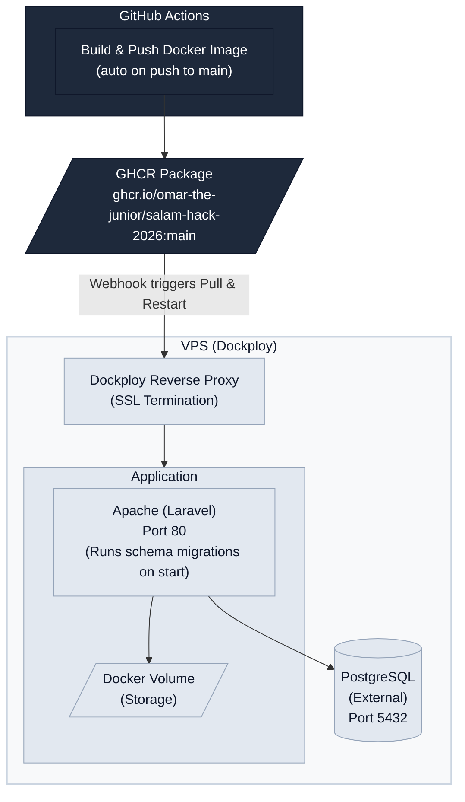

# مُسْتَحَقّ — Deployment Handbook

**Version:** 2.0
**Platform:** VPS + Dockploy + PostgreSQL
**Status:** Production-ready

---

## 1. Prerequisites

| Requirement | Minimum | Notes |
|---|---|---|
| **VPS** | Ubuntu 22.04+, 2 vCPU, 2 GB RAM | DigitalOcean, Hetzner, or any VPS provider |
| **Docker** | 24.x+ | Installed by Dockploy |
| **Dockploy** | Latest | Self-hosted PaaS panel — [dockploy.com](https://dockploy.com) |
| **PostgreSQL** | 15+ | External managed DB or Dockploy built-in database service |
| **Domain** | Any | Pointed to VPS IP via A record |
| **GitHub** | Account + repo | For GHCR image pulls and CI/CD |
| **SMTP** | Any | Resend, Mailgun, or standard SMTP for transactional email |

---

## 2. Environment Variables

### Core Application

| Variable | Production Value | Description |
|---|---|---|
| `APP_NAME` | `"مُسْتَحَقّ"` | Application display name |
| `APP_ENV` | `production` | Environment mode |
| `APP_KEY` | `base64:...` | Generate with `php artisan key:generate --show` |
| `APP_DEBUG` | `false` | **Never** enable in production |
| `APP_URL` | `https://your-domain.com` | Public URL (used for links, OAuth callbacks) |

### Database (PostgreSQL)

| Variable | Example Value | Description |
|---|---|---|
| `DB_CONNECTION` | `pgsql` | **Must be `pgsql`** — not `sqlite` |
| `DB_HOST` | `postgres` or external host | PostgreSQL server hostname |
| `DB_PORT` | `5432` | PostgreSQL port |
| `DB_DATABASE` | `mustahaq` | Database name |
| `DB_USERNAME` | `mustahaq_user` | Database user |
| `DB_PASSWORD` | `<strong-password>` | Database password |

### Session / Cache / Queue

| Variable | Value | Description |
|---|---|---|
| `SESSION_DRIVER` | `database` | Sessions stored in DB |
| `CACHE_STORE` | `database` | Cache stored in DB |
| `QUEUE_CONNECTION` | `database` | Jobs stored in DB |

### Logging

| Variable | Value | Description |
|---|---|---|
| `LOG_CHANNEL` | `stack` | Use stack driver |
| `LOG_LEVEL` | `error` | Only errors in production |

### OAuth (Google)

| Variable | Description |
|---|---|
| `GOOGLE_CLIENT_ID` | Google OAuth client ID |
| `GOOGLE_CLIENT_SECRET` | Google OAuth client secret |
| `GOOGLE_REDIRECT_URI` | `https://your-domain.com/auth/google/callback` |

### Payments (Paymob)

| Variable | Description |
|---|---|
| `PAYMOB_API_KEY` | Paymob dashboard API key |
| `PAYMOB_INTEGRATION_ID` | Payment integration ID |
| `PAYMOB_IFRAME_ID` | Payment iframe ID |
| `PAYMOB_HMAC_SECRET` | HMAC verification secret |

### AI

| Variable | Description |
|---|---|
| `GEMINI_API_KEY` | Google Gemini API key |
| `GEMINI_CANCEL_SUBSCRIPTION_MODEL` | `gemini-3-flash-preview` (free) or `gemini-3.1-pro-preview` (paid) |
| `OPENROUTER_API_KEY` | OpenRouter API key (fallback) |
| `OPENROUTER_CANCEL_SUBSCRIPTION_MODEL` | Model slug for cancellation instructions |
| `OPENROUTER_EMAIL_PARSER_MODEL` | Model slug for email parsing |

### Mail

| Variable | Value |
|---|---|
| `MAIL_MAILER` | `resend` or `smtp` |
| `RESEND_API_KEY` | Resend API key (if using Resend) |
| `MAIL_FROM_ADDRESS` | `noreply@your-domain.com` |
| `MAIL_FROM_NAME` | `"مُسْتَحَقّ"` |

---

## 3. Local Development Setup

```bash
# 1. Clone the repository
git clone https://github.com/omar-the-junior/salam-hack-2026.git
cd salam-hack-2026

# 2. Full setup (installs dependencies, runs migrations, builds frontend)
composer setup

# 3. Start development environment (server + queue + Vite)
composer dev
```

Visit `http://localhost:8000`. Local dev uses SQLite by default — no PostgreSQL needed locally.

---

## 4. Production Deployment (VPS + Dockploy)

### Architecture



The production container is a single `php:8.4-apache` image that:
- Serves HTTP on port 80 (Dockploy's reverse proxy handles SSL termination)
- Runs `php artisan migrate` and `php artisan optimize` on every startup
- Connects to an external PostgreSQL database

### Step 1: Set Up Dockploy on Your VPS

```bash
# SSH into your VPS
ssh root@your-vps-ip

# Install Dockploy (one-click installer)
curl -sSL https://dockploy.com/install.sh | sh
```

Follow the on-screen setup wizard. Once complete, access the Dockploy panel at `http://your-vps-ip:3000`.

### Step 2: Add GitHub Repository Secret

In your GitHub repository → **Settings → Secrets and variables → Actions**, add:

| Secret name | Value |
|---|---|
| `DOKPLOY_DEPLOYMENT_HOOK` | Webhook URL from Dockploy → your app → **Deployments** → **Webhook** |

`GITHUB_TOKEN` (for GHCR push) is provided automatically by GitHub Actions.

### Step 3: Create Application in Dockploy

1. In Dockploy panel, create a new **Docker Compose** application
2. Set the source to your `docker-compose.prod.yml` (paste it or connect via Git)
3. Under **Domains**, point your domain to the `app` service on port **80**
4. If your GHCR package is **private**: go to **Registry** in Dockploy and add a GitHub PAT with `read:packages` scope

### Step 4: Set Up PostgreSQL

**Option A — Dockploy Built-in Database:**

1. In Dockploy, go to **Databases** → **Add Database**
2. Select **PostgreSQL**, set a name (e.g., `mustahaq-db`)
3. Configure credentials (username, password, database name)
4. Note the connection details Dockploy provides (host, port, user, password, database)

**Option B — External PostgreSQL:**

1. Install PostgreSQL on the VPS or use a managed service (Supabase, Neon, etc.)
2. Create a database and user:
   ```sql
   CREATE USER mustahaq_user WITH PASSWORD 'your-strong-password';
   CREATE DATABASE mustahaq OWNER mustahaq_user;
   GRANT ALL PRIVILEGES ON DATABASE mustahaq TO mustahaq_user;
   ```

### Step 5: Configure Environment Variables

In Dockploy → your app → **Environment** tab, set all variables from Section 2 above.

**Critical PostgreSQL variables:**

```env
DB_CONNECTION=pgsql
DB_HOST=<postgres-host>      # e.g., "postgres" if using Dockploy built-in DB
DB_PORT=5432
DB_DATABASE=mustahaq
DB_USERNAME=mustahaq_user
DB_PASSWORD=<your-strong-password>
```

### Step 6: Deploy

1. Push to `main` branch on GitHub
2. GitHub Actions builds and pushes the Docker image to GHCR
3. Actions POSTs to the Dockploy webhook
4. Dockploy pulls the new image and performs a rolling restart
5. On container start, the entrypoint runs migrations and re-caches configuration

---

## 5. Database Migrations

### Automatic (on every deploy)

The entrypoint script (`scripts/php-entrypoint`) runs migrations automatically on container startup with retry logic (10 attempts, 3s interval).

### Manual

```bash
# Inside the running container
docker exec -it <container-name> php artisan migrate --force

# Rollback last batch
docker exec -it <container-name> php artisan migrate:rollback --force

# Fresh migration (⚠️ destructive — drops all tables)
docker exec -it <container-name> php artisan migrate:fresh --force

# Run seeders
docker exec -it <container-name> php artisan db:seed --force
```

### PostgreSQL-specific Notes

- The Docker image includes `pdo_pgsql` and `pgsql` extensions
- Ensure `pg_hba.conf` allows connections from the Docker network
- For Dockploy built-in DB, networking is handled automatically
- For external DB, ensure the DB host is reachable from the Docker container

---

## 6. Payment Gateway Setup (Paymob)

1. **Create a Paymob account** at [paymob.com](https://paymob.com)
2. **Get your API Key** from the dashboard → Settings → API Key
3. **Create an Integration ID** — choose payment methods (Cards, Fawry, Vodafone Cash, Orange Money)
4. **Get the Iframe ID** — generated when you create an integration
5. **Set the HMAC Secret** — found in your Paymob profile settings

Set these environment variables in Dockploy:

```env
PAYMOB_API_KEY=<your-api-key>
PAYMOB_INTEGRATION_ID=<integration-id>
PAYMOB_IFRAME_ID=<iframe-id>
PAYMOB_HMAC_SECRET=<hmac-secret>
```

---

## 7. AI Service Configuration (Gemini + OpenRouter)

### Gemini (Primary)

1. Go to [Google AI Studio](https://aistudio.google.com/) → **Get API Key**
2. Create or select a Google Cloud project
3. Copy the API key

### OpenRouter (Fallback)

1. Go to [openrouter.ai](https://openrouter.ai) → **Create Account**
2. Generate an API key
3. Select models for cancellation instructions and email parsing

```env
GEMINI_API_KEY=<your-gemini-key>
GEMINI_CANCEL_SUBSCRIPTION_MODEL=gemini-3-flash-preview
OPENROUTER_API_KEY=<your-openrouter-key>
OPENROUTER_CANCEL_SUBSCRIPTION_MODEL=nvidia/nemotron-3-nano-omni-30b-a3b-reasoning:free
OPENROUTER_EMAIL_PARSER_MODEL=nvidia/nemotron-3-nano-omni-30b-a3b-reasoning:free
```

---

## 8. Email Scanner Setup (Gmail OAuth)

1. Go to [Google Cloud Console](https://console.cloud.google.com/)
2. Create a new project (e.g., "Mustahaq Email Scanner")
3. Enable the **Gmail API** from the API Library
4. Configure the **OAuth consent screen**:
   - User type: External
   - Add scopes: `gmail.readonly`
   - Add test users (if in testing mode)
5. Create **OAuth 2.0 Credentials** → Web application
6. Add authorized redirect URI: `https://your-domain.com/auth/google/callback`
7. Copy the Client ID and Client Secret

```env
GOOGLE_CLIENT_ID=<your-client-id>
GOOGLE_CLIENT_SECRET=<your-client-secret>
GOOGLE_REDIRECT_URI=https://your-domain.com/auth/google/callback
```

---

## 9. File Storage Setup

The default production setup uses Laravel's `local` disk (files stored in the `storage` Docker volume).

**Future options:**

| Provider | Use Case | Config |
|---|---|---|
| **MinIO** | Self-hosted S3-compatible storage | Set `FILESYSTEM_DISK=s3` + AWS_* vars |
| **Cloudflare R2** | Cloud S3-compatible, zero egress | Set `FILESYSTEM_DISK=s3` + AWS_* vars |

No additional setup is needed for the MVP — the `storage` Docker volume persists across deploys.

---

## 10. Email Notifications Setup (Resend)

1. Go to [resend.com](https://resend.com) → **Create Account**
2. Add and verify your domain (DNS records: SPF, DKIM, DMARC)
3. Generate an API key

```env
MAIL_MAILER=resend
RESEND_API_KEY=re_xxxxxxxxxxxxxxxxx
MAIL_FROM_ADDRESS=noreply@your-domain.com
MAIL_FROM_NAME="مُسْتَحَقّ"
```

---

## 11. Troubleshooting

### Container won't start

```bash
# Check container logs in Dockploy or via CLI
docker logs <container-name> --tail 100

# Common causes:
# - Missing APP_KEY → generate one: php artisan key:generate --show
# - Permission errors → entrypoint auto-fixes; check volume mounts
```

### PostgreSQL connection refused

```bash
# Verify DB is reachable from the app container
docker exec -it <container-name> php artisan tinker --execute 'DB::connection()->getPdo();'

# Check:
# - DB_HOST is correct (use "postgres" for Dockploy built-in, or IP/hostname for external)
# - DB_PORT is 5432
# - Credentials match
# - pg_hba.conf allows Docker network connections
# - PostgreSQL is running: docker ps | grep postgres
```

### Migrations fail on deploy

```bash
# Check migration status
docker exec -it <container-name> php artisan migrate:status

# Run manually with verbose output
docker exec -it <container-name> php artisan migrate --force -v

# Common causes:
# - DB connection not configured → check DB_* env vars
# - App key missing → check APP_KEY
# - PostgreSQL extensions missing → ensure pgcrypto is available
```

### 502 Bad Gateway

- Dockploy's reverse proxy can't reach the app container
- Ensure the app service exposes port **80** in `docker-compose.prod.yml`
- Check that the container is running: `docker ps`

### Frontend assets not loading (Vite manifest error)

```bash
# Rebuild frontend inside the container (rare — should be baked into image)
docker exec -it <container-name> pnpm run build

# Or trigger a new deploy to rebuild the Docker image
```

### Storage permission errors

```bash
# The entrypoint auto-fixes permissions, but if issues persist:
docker exec -it <container-name> chmod -R 775 /var/www/storage
docker exec -it <container-name> chown -R www-data:www-data /var/www/storage
```

---

*Document prepared for SalamHack 2026 · مُسْتَحَقّ MVP · Updated for VPS + Dockploy + PostgreSQL*
